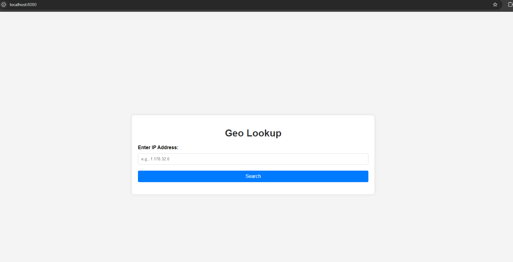
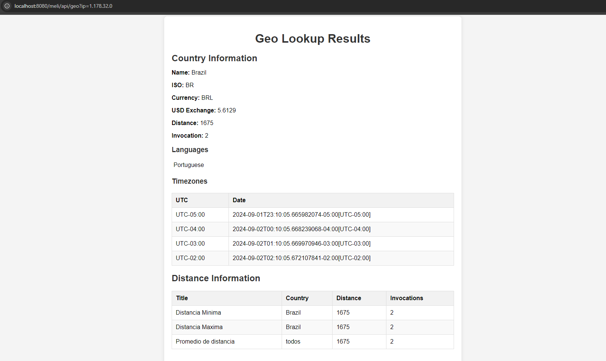
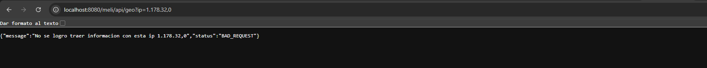
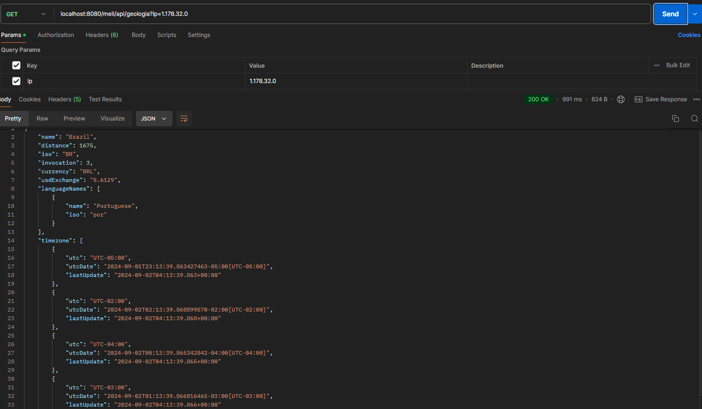
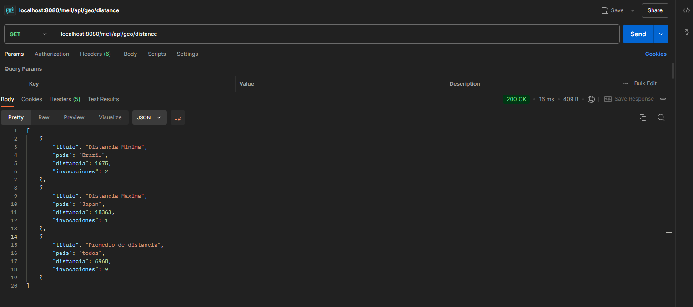

# Nombre del Proyecto

Breve descripción del proyecto. Por ejemplo:

Este proyecto es una API RESTful que permite realizar operaciones geográficas y calcular distancias entre Buenos Aires Argetina
,además de gestionar información como:

  - Name
  - ISO
  - Currency
  - USD Exchange
  - Distance
  - Invocation
  - List de Lenguajes
  - Timezones del pais
---------------------------------------------
adema de esto se entregan las siguientes estadisticas:
Distance Information
- Distancia Minima
- Distancia Maxima
- Promedio de distancia
- Pais de cada estadistica
- Distancia de cada pais
- Numero total de invocaciones por cada pais
---------------------------------------------

## Tecnologías Utilizadas

- Java 21
- Spring Boot 3.3.3
- Maven
- Mockito
- Thymeleaf
- Docker
- PostgreSQL

## Requisitos Previos

Antes de comenzar, asegúrate de tener instalados los siguientes requisitos:

- Java 21
- Maven 3.3.3 o superior
- Docker (para la base de datos y montar el Jar)

## Instalación
1. Clona este repositorio en tu máquina local.
   - git clone https://github.com/JuanMHerreraMoya/geo.git
   - cd geo
---------------------------------------------
2. Construye el proyecto usando Maven.
   - mvn clean install
---------------------------------------------
3. Inicia el contenedor de PostgreSQL (si estás utilizando Docker).
   - docker-compose build
---------------------------------------------
4. Ejecuta la aplicación
   - docker-compose up -d
---------------------------------------------

## Uso

Una vez que la aplicación esté en ejecución, puedes acceder a la interfaz de usuario en http://localhost:8080.
aca vera la siguiente pestaña

una vez se inserte la ip publica. (Cabe recalcar que las ip privadas no se pueden consultar)
vera el siguiente resultado.

aca vemos todas las metricas anteriormente comentadas. Y cuando existe una ip que no es 
correcta saldra el siguiente error.

tambien se puede hacer desde una aplicacion como Postman donde uno resiva curls:

curl --location 'localhost:8080/meli/api/geologia?ip=1.178.32.0'

y tambien hay un endpoint para consultar las estadisticas

curl --location 'localhost:8080/meli/api/geo/distance'

## Importante

Las api para consultar tienen un maximo de consutlar ya que es la version gratuita, 
el appi de exchangerate-api tiene un maximo de 1200 Consultas, luego de eso es de pago
para poder consultar el Exchange de las monedas.

No se usaron algunas Api's recomendadas por que o no funcionaban 
o los exchange no los dejaba hacer a USD solo Euros.